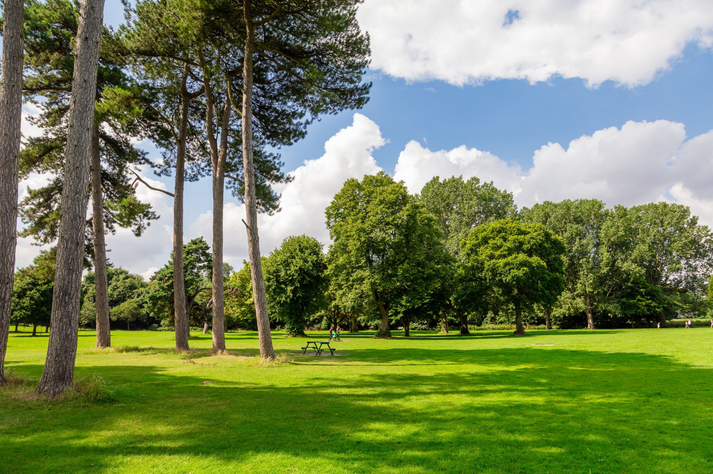
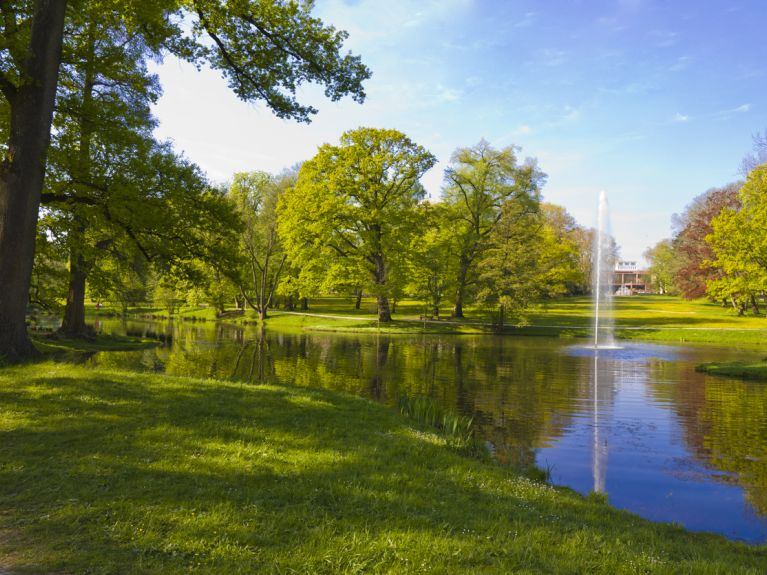
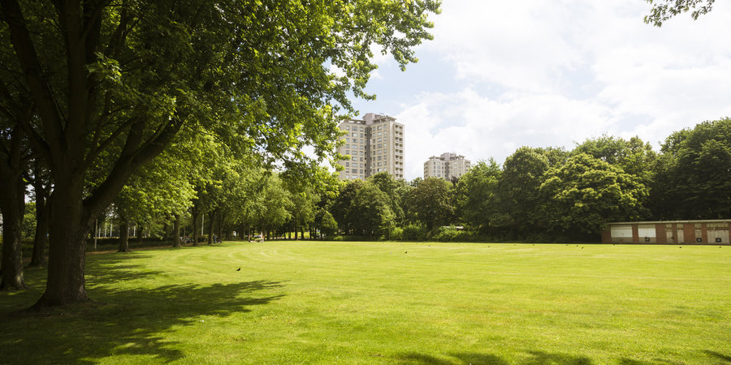
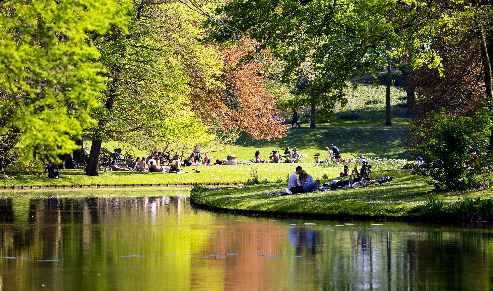
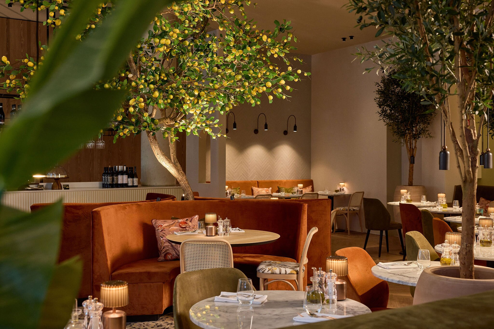
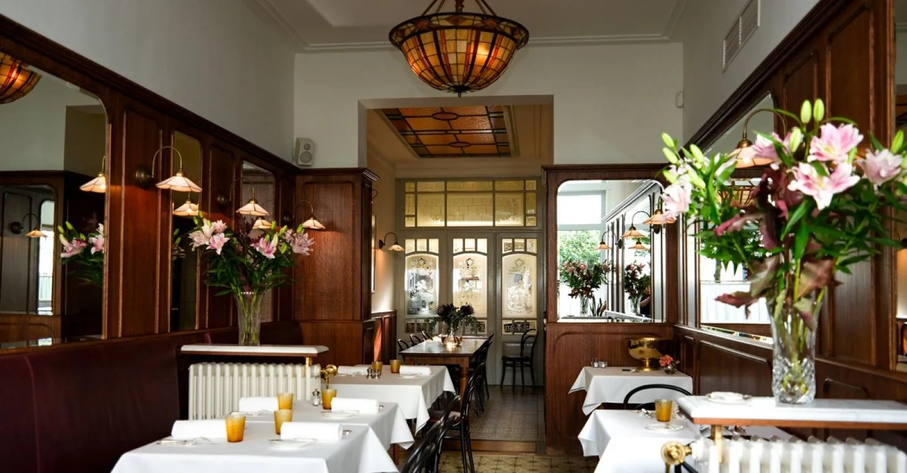
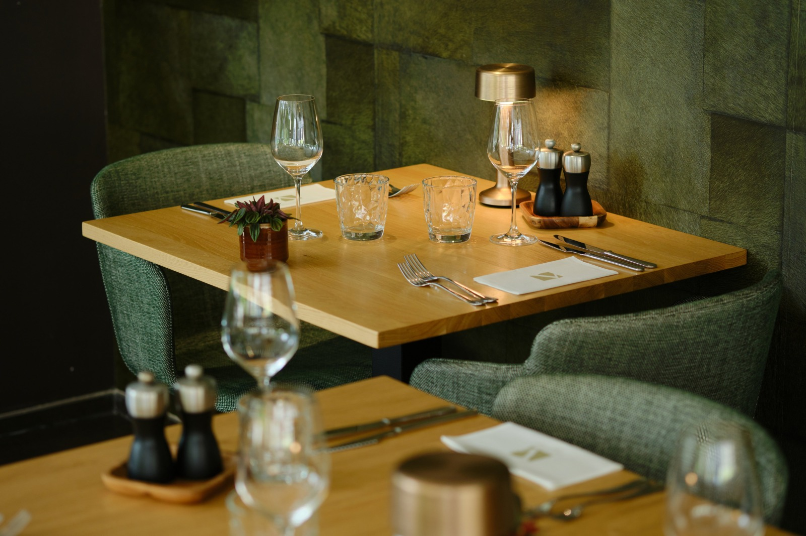
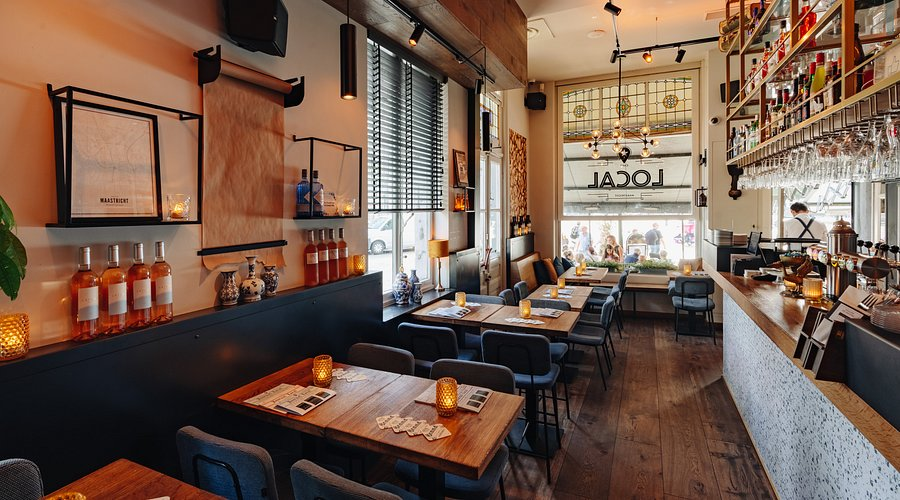
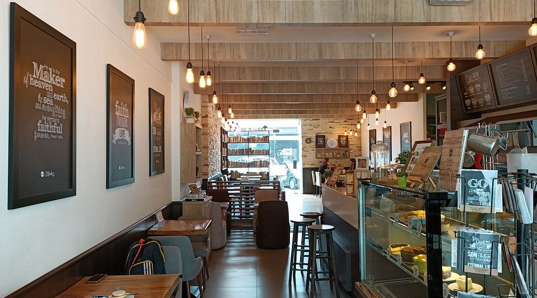
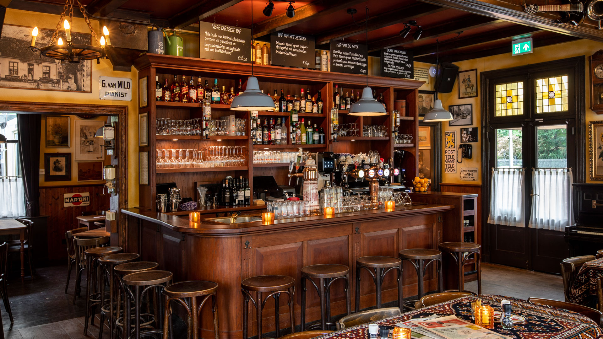

# Image credits

## Parks

Source: https://www.nelincs.gov.uk/leisure-and-things-to-do/parks-and-open-spaces/

Source: https://www.deutschland.de/en/topic/life/lifestyle-and-cuisine/germanys-most-beautiful-parks

Source: https://www.antwerpen.be/info/52d5051f39d8a6ec798b47d5/kielpark

Source: https://www.rotterdam.info/nl/visit/guide/parken-in-rotterdam

## Restaurants

Source: https://www.tripadvisor.be/Restaurants-g188666-zfp58-Ghent_East_Flanders_Province.html

Source: https://www.feeling.be/food-2/vlaamse-kost-brasseries-antwerpen/

Source: https://visitwallonia.be/nl/119/blog/warm-aanbevolen-restaurants

Source: https://hrewards.com/nl/steigenberger-hotel-hamburg/restaurant-bar/stadthaus

## Cafes

Source: https://www.tripadvisor.be/Restaurant_Review-g188575-d7083297-Reviews-or120-Cafe_Local-Maastricht_Limburg_Province.html

Source: https://www.tripadvisor.be/Restaurant_Review-g303998-d8023795-Reviews-The_Maker_Cafe-Miri_Miri_District_Sarawak.html

Source: https://www.gaultmillau.be/en/restaurants/cafe-commercial-antwerpen

Source: https://cafehettolhuis.nl/
